<a name="readme-top"></a>
# Informatyczna Tkanina
Simple project of website where you can download wallpapers.

## Table of contents
* [About the project](#About-the-project)
* [Built with](#Built-with)
* [Prerequisites](#Prerequisites)
* [Installation](#Installation)
* [Login details](#Login-details)
* [Future](#Future)
* [Walkthrough](#Walkthrough)
    * [Layout](#Layout)
      * [Header](#Header)
      * [Navbar](#Navbar)
    * [Basic pages](#Basic-pages)
      * [Main page](#Main-page)
      * [Category page](#Category-page)
      * [Wallpaper page](#Wallpaper-page)
    * [Admin pages](#Admin-pages)
      * [Admin navbar](#Admin-navbar)
      * [Wallpapers list page](#Wallpapers-list-page)
      * [Add new wallpaper page](#Add-new-wallpaper-page)
      * [Modify wallpaper page](#Modify-wallpaper-page)
      * [Categories list page](#Categories-list-page)
      * [Add new category page](#Add-new-category-page)
      * [Users list page](#Users-list-page)
      * [Add new user page](#Add-new-user-page)

## About The Project

**Informatyczna Tkanina** is a project of responsive website where you can scroll through different wallpapers, use simple filters and download it. Images are scaled down when adding wallpapers for optimization purposes.
<br>
**After** logged in you can add new: category, wallpaper, and then you can modify and delete them. Only main(first) admin can register new user and main admin cannot delete its account or change its password. Page is also kinda done by MVC pattern(In progress).

<p align="right">(<a href="#readme-top">back to top</a>)</p>

### Built with

* Bootstrap 5.2.1
* PHP 8.1.6
* MySql 10.4.24-MariaDB

<p align="right">(<a href="#readme-top">back to top</a>)</p>

### Prerequisites

- Website requires <a href="https://www.php.net/manual/en/image.setup.php">gd library</a> to work properly. When adding new wallpapers, images are scaling using function from there. 

### Installation

- Upload project to the directory of your choice.
- Import MySql Database file (/DataBase/informatyczna-tkanina.sql) to your database software (E.g PhpMyAdmin).
- Configure connection to your database and server by modifying /data/config.php file.
- Navigate to the installation in your browser.
- Finished

### Login details
#### Main admin (ID=1)
- login: ```` admin ````
- password: ```` I6rF^7r0%v2k ````
#### Test admin
- login: ```` admin1 ````
- password: ```` test123 ````

<p align="right">(<a href="#readme-top">back to top</a>)</p>

### Future
* I want to add docker
* I want to create simple framework mvc 
# Walkthrough

## **Layout**

### **Header**

Clicking on logo will bring you to homepage, and clicking on right to log in will bring up login form.
<br>
<br>
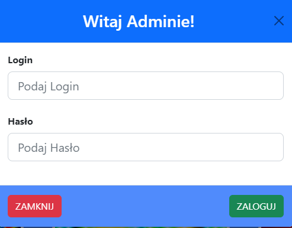
<br>
Login form verifies if combination of login and hashed password are same in database.
<br>
If not it will bring error.
<br>
<br>
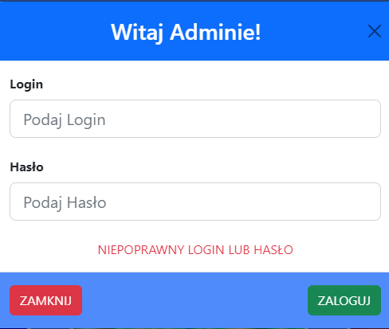
<br>
If login and password are correct a <a href="#Admin-navbar">admin navbar will appear</a>.
<br>
<br>

Also button to log in will be changed that you can logout.
<br>
<br>

### **Navbar**
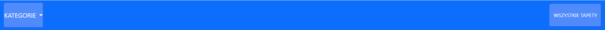
On left we will see menu of current categories.
<br>
<br>
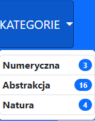
<br>
And also number of how many wallpapers are in this category.
<br>
Selecting category or getting all wallpapers will bring you to 
<a href="#Category-page">category page</a>
<br>
<br>
<p align="right">(<a href="#readme-top">back to top</a>)</p>

## **Basic pages**

### **Main page**
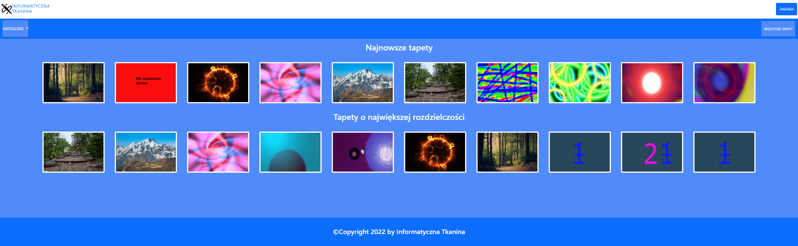
Here we can see the newest having the biggest resolution wallpapers (10 of each).
<br>
<br>
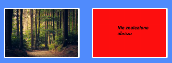
<br>
If there are something wrong with image an error will be shown.
<br>
Selecting any wallpaper will bring you to <a href=#Wallpaper-page>wallpaper page</a>.
<br>
<br>
<p align="right">(<a href="#readme-top">back to top</a>)</p>

### **Category page**
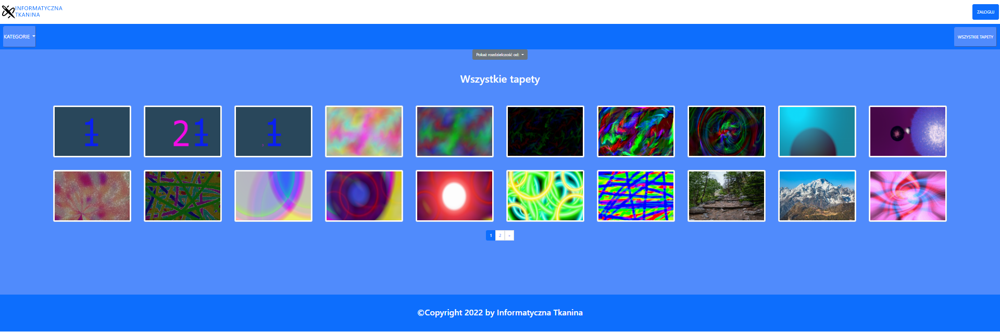
Category page will show all wallpapers of specified category and/or with specified resolution lists, and if there are more than 20 wallpapers pagination will appear.
<br>
<br>
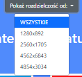
<br>
Resolution list is dynamic depending on of all specified by category wallpapers.
<br>
<br>
<p align="right">(<a href="#readme-top">back to top</a>)</p>

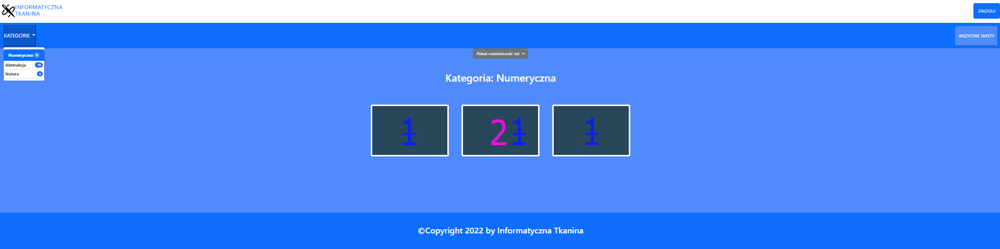
Here category is selected.
<br>
Selecting any wallpaper will bring you to <a href=#Wallpaper-page>wallpaper page</a>.
<br>
<br>
<p align="right">(<a href="#readme-top">back to top</a>)</p>

### **Wallpaper page**
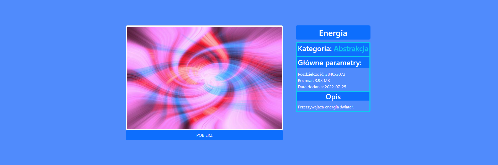
On wallpaper page we can see its miniature, title, category, description and button to download full image.
<br>
<br>
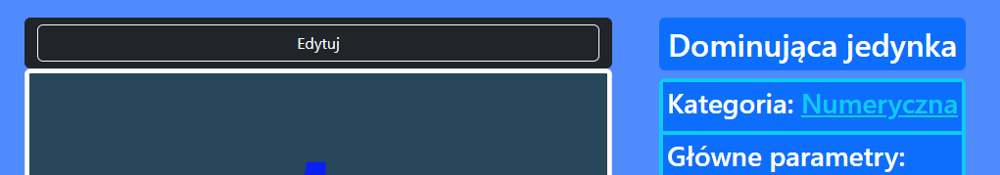
After being logged in a button will appear leading you to <a href="#Modify-wallpaper-page">page where we can edit this wallpaper</a>.
<br>
<br>

<p align="right">(<a href="#readme-top">back to top</a>)</p>

## **Admin pages**

### **Admin navbar**
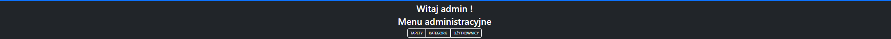
After being logged in, admin navbar will appear with buttons which will direct you to:<br>
- <a href=#Wallpapers-list-page>Wallpapers list</a>
- <a href=#Categories-list-page>Categories list</a>
- <a href=#Users-list-page>User list</a>
<br>
<br>

### **Wallpapers list page**
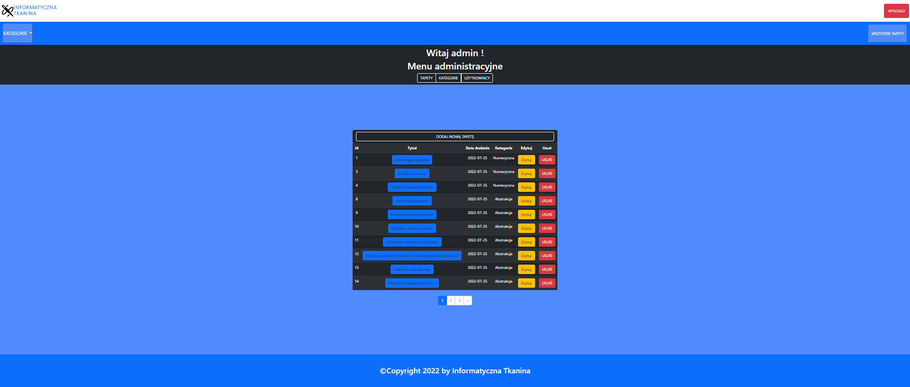
Here we can see all current wallpapers and buttons to <a href="#Modify-wallpaper-page">edit them</a>, delete them and also <a href="Add-new-wallpaper-page">add new one</a>.
<br>Clicking on title will bring you to 
<a href="#Wallpaper-page">its page</a>.
<br>
<br>
<p align="right">(<a href="#readme-top">back to top</a>)</p>

### **Add new wallpaper page**
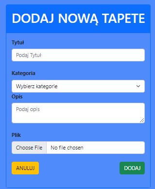
<br>
Form to add new wallpaper.
<br>
<br>
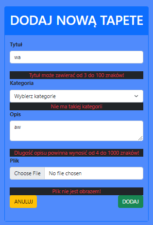
<br>
Input is checked and if it does not meet requirements error will show.
Values that meet requirements, will be saved in case of another value is not accepted.
If everything is good, values will be added to database. Image will be sent to be stored on server and add its two new scaled down versions, and you will be redirected to <a href="#Wallpapers-list-page">wallpapers list</a>.
<br>
<br>
<p align="right">(<a href="#readme-top">back to top</a>)</p>

### **Modify wallpaper page**
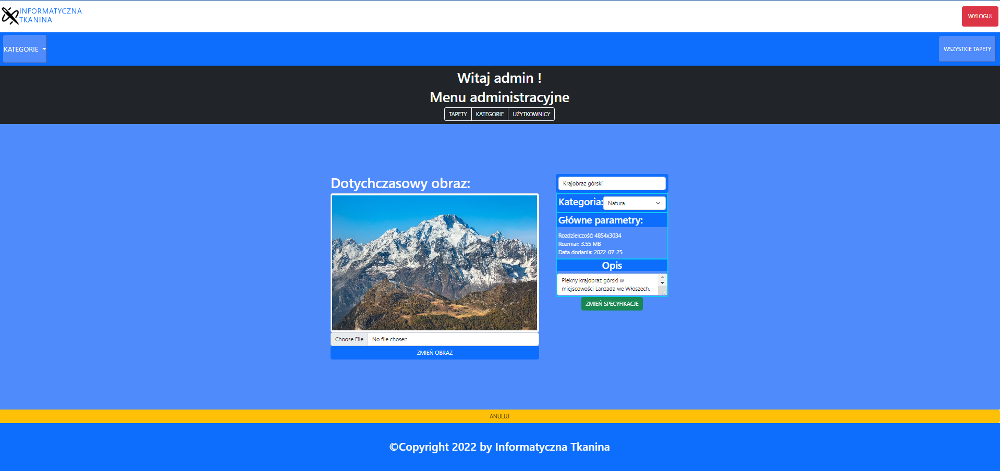
Page is very similar to <a href="#Wallpaper-page">wallpaper display</a>. Its default values are those that are current ones.
<br>
On left we can see current image of wallpaper and file input that only accepts images, after that we can see button to change **only** the image.
<br>
On right we see parameters, that are checked by the same requirements as those on <a href="#Add-new-wallpaper-page">add new wallpaper page</a>. Image(main) parameters can only be changed by changing image. And then there's green button to change **only** the parameters.
<br>
If requirements for image are meet, old images will be deleted and new one will be added, and if values of parameters are accepted, they are also will be changed, and you will be redirected to <a href="#Wallpaper-page">wallpaper view</a>.
<br>
At the button we can see cancel button which will bring you to <a href="#Wallpaper-page">wallpaper view</a>.
<br>
<br>
<p align="right">(<a href="#readme-top">back to top</a>)</p>

### **Categories list page**

<br>
Here we can see all categories with buttons to <a href="#Add-new-category-page">add new</a>, edit or delete category.
<br>
<br>
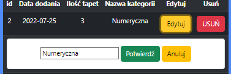
<br>
After clicking on edit, form to edit its name will appear, and after clicking accept name will be verified. When it meets requirements it will be changed in database.
<br>
<br>
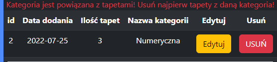
<br>
If you click to delete button, it will check if any wallpapers are assigned to it and if not error will be shown. Otherwise, it will be deleted. 
<br>
<br>
<p align="right">(<a href="#readme-top">back to top</a>)</p>

### **Add new category page**

<br>
Form to add new category.
<br>
<br>
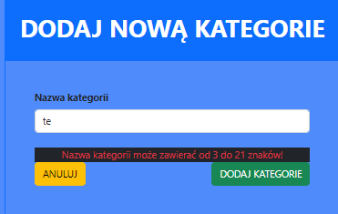
<br>
If category name is short,too long or name repeats it will show error.
<br>
If name meets requirements category will be added to database, and you will be redirected to
<a href="#Categories-list-page">category list page</a>.
<br>
<br>
<p align="right">(<a href="#readme-top">back to top</a>)</p>

### **Users list page**

<br>
If you are logged in as main(first ID) admin then three buttons will be shown: <a href="#Add-new-user-page">to add new user</a>, change password and delete account.
<br>
<br>

If you are logged using any other account you will only see two buttons: to change password and to delete account.
<br>
<br>
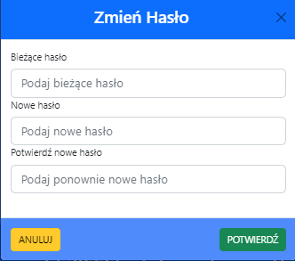
<br>
Form to change password.
<br>
<br>
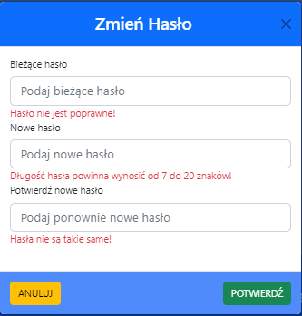
<br>
If current password is incorrect, new one is too long or short or confirmed password is not same error will appear.
<br>
If current password checks out, and new one and its repetition is correct password will be changed and hashed changed in database.
<br>
<br>
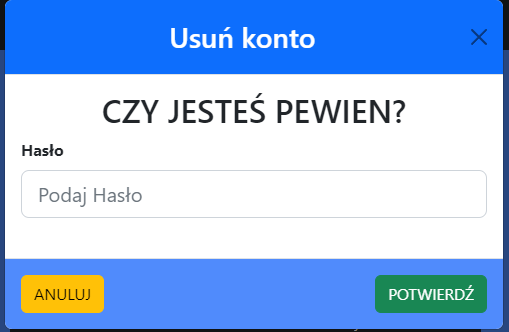
<br>
Form to delete your account.
<br>
<br>

<br>
If password does not match error will appear. Otherwise, account will be deleted from database, and you will be logged out and brought to <a href="#Main-page">index page</a>.
<br>
<br>
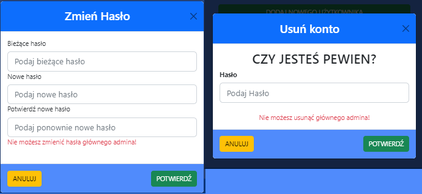
<br>
Password of main admin cannot be changed or its account cannot be deleted.
<br>
<br>
<p align="right">(<a href="#readme-top">back to top</a>)</p>

### **Add new user page**

<br>
Form to add new user.
<br>
<br>
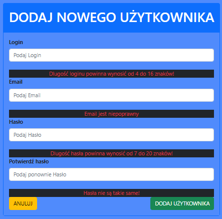
<br>
If any input is incorrect error or errors will appear. If value meets requirements it will be temporally saved in case of others are wrong.
<br>
If everything checks out new user will be added(password is hashed) you will be brought to <a href="#Users-list-page">users list page</a>.

<p align="right">(<a href="#readme-top">back to top</a>)</p>
